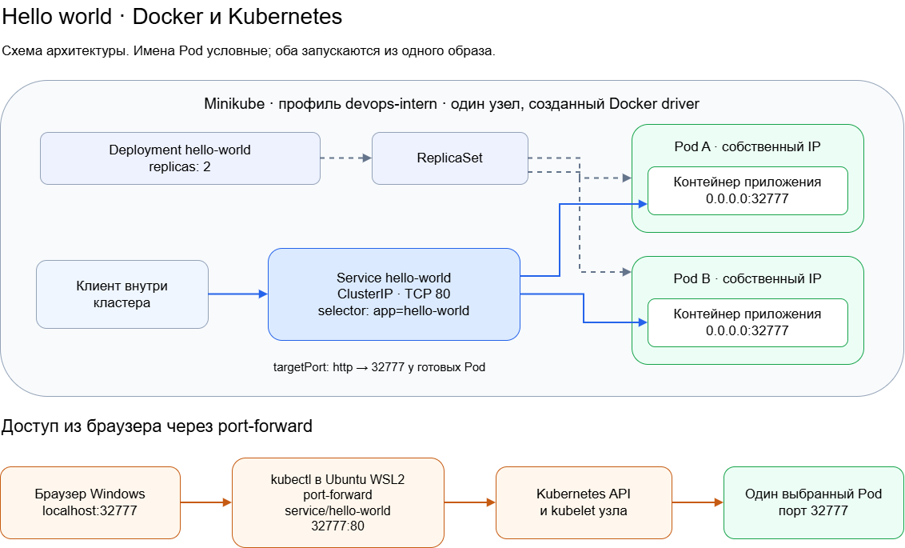

# Тестовое задание DevOps стажёра

Веб-приложение на Python возвращает `Hello world!` по HTTP на порту **32777**. Приложение упаковано в Docker-образ и развёрнуто в Minikube с помощью Deployment с двумя репликами и Service типа ClusterIP.

## Материалы

- [Ответы на 8 теоретических вопросов](docs/theory.md)
- [Docker Hub: xumuk595/devops-hello:1.0.0](https://hub.docker.com/r/xumuk595/devops-hello/tags)
- [Схема draw.io](docs/architecture.drawio)
- [Скриншоты результатов](docs/screenshots/README.md)

## Структура проекта

```text
.
├── app.py
├── Dockerfile
├── .dockerignore
├── .gitignore
├── .gitattributes
├── README.md
├── k8s/
│   ├── deployment.yaml
│   └── service.yaml
└── docs/
    ├── theory.md
    ├── architecture.drawio
    ├── architecture.png
    └── screenshots/
```

## Окружение

Работа проверена в Ubuntu 24.04 под WSL2 с Docker Desktop. Использованы Docker Engine 29.8.0 и Kubernetes v1.37.0. Кластер Minikube состоит из одного узла.

Docker Desktop устанавливается по [официальной инструкции](https://docs.docker.com/desktop/setup/install/windows-install/). Для доступа из Ubuntu включена [WSL Integration](https://docs.docker.com/desktop/features/wsl/).

Дальнейшие команды выполняются в Ubuntu. Необходимы Git, curl и работающий Docker:

```bash
docker version
git clone https://github.com/mosckalenckomaksim19-create/devops-intern.git
cd devops-intern
```

## Приложение

Приложение использует стандартную библиотеку Python, без внешних зависимостей.

| Адрес | Ответ |
| --- | --- |
| `/` | HTML-страница Hello world с именем экземпляра |
| `/healthz` | HTTP 200 и `ok` |

Локальный запуск при установленном Python 3:

```bash
python3 app.py
```

Проверка из другого терминала:

```bash
curl -i http://127.0.0.1:32777/
curl -i http://127.0.0.1:32777/healthz
```

Перед запуском Docker-контейнера локальный процесс останавливается через Ctrl+C для освобождения порта.

## Docker

Сборка и запуск:

```bash
docker build -t devops-hello:1.0.0 .
docker run --rm -d --name devops-hello-local -p 127.0.0.1:32777:32777 devops-hello:1.0.0
curl -i http://127.0.0.1:32777/
docker logs devops-hello-local
```

Команды публикации выполненного решения:

```bash
docker login
docker tag devops-hello:1.0.0 xumuk595/devops-hello:1.0.0
docker push xumuk595/devops-hello:1.0.0
```

Для публикации собственной копии требуется заменить `xumuk595` на имя своего аккаунта. Для запуска готового решения используется опубликованный образ без изменений.

Digest опубликованного образа:

```text
sha256:7e4bbcbaa1466daf2f4c221a41096f1aa3e9ba5fe838825c1d7386a8ef97d553
```

После проверки локальный контейнер останавливается:

```bash
docker stop devops-hello-local
```

## Minikube

Установка для Linux x86_64 по [официальной инструкции Minikube](https://minikube.sigs.k8s.io/docs/start/):

```bash
curl -fLO https://github.com/kubernetes/minikube/releases/latest/download/minikube-linux-amd64
sudo install minikube-linux-amd64 /usr/local/bin/minikube
minikube version
```

Загруженный установочный файл не входит в Git-репозиторий. Команда запуска кластера выполняется без sudo:

```bash
minikube start -p devops-intern --driver=docker --cpus=2 --memory=3072
minikube status -p devops-intern
minikube -p devops-intern kubectl -- get nodes
```

В текущем терминале используется сокращение:

```bash
alias kubectl='minikube -p devops-intern kubectl --'
```

В новом терминале alias необходимо задать повторно либо использовать полный вызов `minikube -p devops-intern kubectl --`.

## Развёртывание в Kubernetes

Манифест Deployment содержит образ `xumuk595/devops-hello:1.0.0` и `replicas: 2`. В каждом Pod запускается один контейнер, слушающий порт 32777. Service выбирает Pod по метке `app: hello-world` и направляет свой порт 80 на именованный порт `http` контейнера.

```bash
kubectl apply --dry-run=server -f k8s/
kubectl apply -f k8s/
kubectl rollout status deployment/hello-world --timeout=180s
kubectl get deployment hello-world
kubectl get pods -l app=hello-world -o wide
kubectl get service hello-world
kubectl get endpointslices -l kubernetes.io/service-name=hello-world -o wide
```

Readiness и liveness проверяют `/healthz`. Для контейнеров заданы requests и limits CPU и памяти. Две реплики находятся на одном узле; такая конфигурация не обеспечивает устойчивость к отказу узла.

## Доступ из браузера

В отдельном терминале запускается проброс порта:

```bash
minikube -p devops-intern kubectl -- port-forward service/hello-world 32777:80 --address=127.0.0.1
```

Адрес в браузере: **http://localhost:32777/**. Терминал с port-forward должен оставаться открытым. Локальный порт 32777 должен быть свободен.

Port-forward к Service выбирает один Pod. Для отдельной проверки доступа через ClusterIP изнутри кластера выполнены запросы к DNS-имени Service:

```bash
kubectl exec -i deployment/hello-world -- python - <<'PY'
from collections import Counter
from urllib.request import urlopen

instances = Counter()
for _ in range(20):
    with urlopen("http://hello-world:80/", timeout=5) as response:
        instances[response.headers["X-Instance"]] += 1
        response.read()
print(instances)
PY
```

## Результаты проверки

- `/` и `/healthz` возвращают HTTP 200 при локальном запуске и в Docker.
- Deployment: `READY 2/2`, `UP-TO-DATE 2`, `AVAILABLE 2`.
- Два Pod: `Running`, каждый `READY 1/1`, перезапусков на момент проверки — 0.
- EndpointSlice содержит адреса обеих реплик с портом 32777.
- Через port-forward в браузере открывается страница с именем Pod.
- Из 20 запросов через Service одна реплика обработала 11, другая — 9. Равномерность каждой серии запросов не гарантируется.

Скриншоты приведены в [docs/screenshots](docs/screenshots/README.md).

## Схема



[Редактируемый исходник draw.io](docs/architecture.drawio).

## Остановка

После остановки port-forward через Ctrl+C:

```bash
minikube stop -p devops-intern
```
